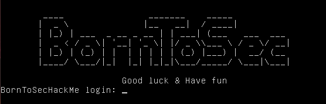

# Boot2Root:
Security challenge. The goal is to become root on the machine by exploiting the server's vulnerabilities.

*We are not supposed to exploit the `ISO` file itself*

# Solutions:
As requested by the subject, we need to provide two solutions to the challenge.

## Writeup1:
The first writeup is the solution expected by the subject. It's more of a CTF style solution than a real life scenario.

You can find the writeup at [here](./writeups/writeup1.md)

## Writeup2:
The second writeup is a more realistic solution. It's utalizing a race condition in the kernel to gain root access.

You can find the writeup at [here](./writeups/writeup2.md)

# Documentation:
You will find all specific information about how I solved the different challenges within the writeups file. Any basic information is not provided as you can easily find it on the internet.

## MADE WITH LOVE BY :

<!-- ALL-CONTRIBUTORS-LIST:START - Do not remove or modify this section -->
<!-- prettier-ignore-start -->
<!-- markdownlint-disable -->
<table>
  <tr>
    <td align="center"><a href="https://github.com/assxios/"> <b>Assxios (droge)</b></a> </td>
  </tr>
</table>
<!-- markdownlint-restore -->
<!-- prettier-ignore-end -->
<!-- ALL-CONTRIBUTORS-LIST:END -->